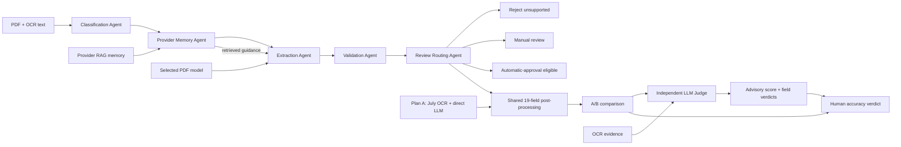

# Plan A / Plan B A/B Test

## Plan B agentic architecture

Plan B uses a **hybrid supervisor workflow with sequential agent handoffs**. It is not currently a Mixture of Agents (MoA).

The supervisor is [`PlanBOrchestrator`](llm/agent/workflow.py). It runs the agents in a fixed sequence and passes a typed shared context between them.

| Agent | Responsibility | Agent type |
| --- | --- | --- |
| [`ClassificationAgent`](llm/agent/workflow.py) | Classifies the document as electricity, water, natural gas, telecom, or unsupported. It stops unsupported documents from qualifying as valid invoices. | Deterministic rules agent |
| [`ProviderMemoryAgent`](llm/agent/workflow.py) | Identifies the supplier, retrieves only that provider's RAG knowledge, and supplies tips, layout knowledge, OCR corrections, and reviewer feedback. | Retrieval/tool agent |
| [`ExtractionAgent`](llm/agent/workflow.py) | Sends the PDF, OCR text, classification hint, and RAG context to the selected Gemini or OpenAI provider. If the model or PDF is unavailable, it records the failure and keeps deterministic extraction. | LLM tool-using agent |
| [`ValidationAgent`](llm/agent/workflow.py) | Checks required fields, real calendar dates, date ordering, finite monetary values, and `subtotal + VAT ≈ total`. | Deterministic critic agent |
| [`ReviewRoutingAgent`](llm/agent/workflow.py) | Chooses unsupported rejection, manual review, or automatic-approval eligibility. It requires five distinct prior approved invoices for automation. | Policy/router agent |

The experiment compares the complete July OCR + direct LLM pipeline with the agentic OCR + LLM pipeline.

Both candidates pass through the same post-processor before validation or completeness scoring. It normalizes dates, currencies, monetary values, quantities, units, VAT identifiers and supported categories. It rejects identity/address values containing financial labels, amounts or currency markers, records only the rejected field names in `extraction_warnings`, and gives rejected values no retrieval credit.

The interaction pattern is a **shared-state blackboard with sequential handoffs**:

1. Agents receive the same typed `AgentContext`.
2. Each agent reads previous results and adds its own output.
3. Later agents act on earlier decisions.
4. The orchestrator records status, decision, metrics, sequence, and duration.
5. Agents do not exchange natural-language messages with one another.
6. There is no voting, debate, parallel candidate generation, or LLM-based manager.

Only the extraction agent is generative. The other agents provide predictable guardrails around the model. This architecture suits invoices because financial extraction benefits from controlled decisions and auditable validation.

MoA would use several extraction agents to analyze the same invoice independently—for example, a regex agent, a Gemini visual agent, an OCR-text agent, and a provider-layout agent. Plan A and Plan B remain an A/B experiment rather than an MoA ensemble. The optional LLM judge adds an evaluator pattern after the two plans; it does not turn the fixed Plan B workflow into MoA.

## Independent LLM judge

The optional judge is deliberately outside `PlanBOrchestrator`, so Plan B does not grade itself. It receives the OCR evidence, both structured candidates, their deterministic validation errors, and their routes. It returns:

- a recommendation of Plan A, Plan B, tie, or inconclusive;
- an estimated 0–10 score for each plan;
- a 0–1 confidence value;
- field-level decisions for disagreements; and
- a short explanation.

The prompt treats invoice text as untrusted evidence and tells the model to abstain when the OCR does not support a value. The judge excludes provider RAG context to reduce preference toward Plan B. Its result is stored in the isolated A/B JSON artifact without storing the API key or raw prompt.

The judge reads OCR text rather than the original pixels, so it cannot detect an OCR error that changes the evidence itself. Its verdict is advisory and cannot approve or reject an invoice. The human verdict remains required and supplies the ground truth for measuring judge agreement and actual A/B accuracy.

The judge supports three connectors. **Gemini** needs a model name plus a Gemini API key. **OpenAI** uses the official Responses API and needs an OpenAI project key plus a model; no base URL is entered. Either official provider can reuse the matching request-only extraction key. **OpenAI-compatible** calls `/v1/chat/completions` and needs `JUDGE_BASE_URL`, `JUDGE_MODEL`, and a bearer key only when that server requires one. No judge model is downloaded by this project. A different judge model is preferable for evaluation independence, although one provider key can authorize both calls when its project permissions allow both models.

## Local Gradio test interface

Run `uv run python scripts\gradio_app.py` and open `http://127.0.0.1:7860`. The interface accepts an invoice PDF or image, runs the built-in OCR pipeline, shows retrieval percentages and all 19 required fields side by side, exposes OCR/post-processing diagnostics and a sanitized stage log, and shows the five-agent trace. **Retrieve fields with GPT / Gemini** runs Plan A (July OCR + direct LLM) and Plan B (the same OCR/model inside the agent workflow). The judge makes a separate external call only after the user requests it. The server rejects non-loopback host arguments.

The **Source-verified A/B assessment** tab keeps these configurations distinct:

| Case | Extraction | Agent workflow | Provider RAG |
| --- | --- | --- | --- |
| `ocr_llm` | **Plan A:** frozen July OCR + direct Gemini/OpenAI extraction | No | No |
| `ocr_llm_agentic` | **Plan B:** frozen July OCR + Gemini/OpenAI extraction | Five-agent workflow | Yes, supplied to the selected provider |

Pasting a key and clicking **Run A/B assessment** makes two extraction calls to the selected provider. Both plans retain valid July fields when the model returns `null`, then overlay non-null model values. The tab renders the source pages next to a 19-row table containing both candidates and the judge's field decisions. A reviewer enters exact source values (or `<absent>`), and the application calculates accuracy against that human ground truth. Field retrieval percentage measures non-null completeness and is not an accuracy claim.

After verification, **Save reviewed fields to KB and test retrieval** overlays the source-verified values on the selected candidate, writes the reviewed example into the matching provider memory, rebuilds the local FAISS/LlamaIndex index, queries it, and reports whether the exact saved example was retrieved. This write occurs only on that explicit action. API keys are never written to the artifact or knowledge base.

The assessment defines electricity, water, natural gas, and telecom as supported invoice categories. The classification and review-routing agents reject documents outside those four categories.
