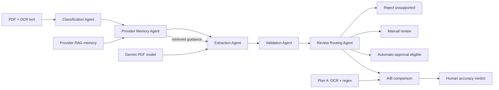

# Plan A / Plan B A/B Test

## Plan B agentic architecture

Plan B uses a **hybrid supervisor workflow with sequential agent handoffs**. It is not currently a Mixture of Agents (MoA).

The supervisor is [`PlanBOrchestrator`](llm/agent/workflow.py). It runs the agents in a fixed sequence and passes a typed shared context between them.

| Agent | Responsibility | Agent type |
| --- | --- | --- |
| [`ClassificationAgent`](llm/agent/workflow.py) | Classifies the document as electricity, water, natural gas, telecom, or unsupported. It stops unsupported documents from qualifying as valid invoices. | Deterministic rules agent |
| [`ProviderMemoryAgent`](llm/agent/workflow.py) | Identifies the supplier, retrieves only that provider's RAG knowledge, and supplies tips, layout knowledge, OCR corrections, and reviewer feedback. | Retrieval/tool agent |
| [`ExtractionAgent`](llm/agent/workflow.py) | Sends the PDF, OCR text, classification hint, and RAG context to Gemini. If Gemini or the PDF is unavailable, it records the failure and keeps deterministic extraction. | LLM tool-using agent |
| [`ValidationAgent`](llm/agent/workflow.py) | Checks required fields, real calendar dates, date ordering, finite monetary values, and `subtotal + VAT ≈ total`. | Deterministic critic agent |
| [`ReviewRoutingAgent`](llm/agent/workflow.py) | Chooses unsupported rejection, manual review, or automatic-approval eligibility. It requires five distinct prior approved invoices for automation. | Policy/router agent |

The interaction pattern is a **shared-state blackboard with sequential handoffs**:

1. Agents receive the same typed `AgentContext`.
2. Each agent reads previous results and adds its own output.
3. Later agents act on earlier decisions.
4. The orchestrator records status, decision, metrics, sequence, and duration.
5. Agents do not exchange natural-language messages with one another.
6. There is no voting, debate, parallel candidate generation, or LLM-based manager.

Only the extraction agent is generative. The other agents provide predictable guardrails around the model. This architecture suits invoices because financial extraction benefits from controlled decisions and auditable validation.

MoA would use several extraction agents to analyze the same invoice independently—for example, a regex agent, a Gemini visual agent, an OCR-text agent, and a provider-layout agent. A judge agent would then compare their candidate fields and resolve disagreements. Plan A and Plan B currently form an A/B experiment, not an MoA ensemble.

## Local Gradio test interface

Run `uv run python scripts\gradio_app.py` and open `http://127.0.0.1:7860`. The interface accepts an invoice PDF or image, runs the built-in OCR pipeline, shows both plan results and the five-agent trace, exposes the provider knowledge base and local FAISS rebuild action, and records the human accuracy verdict in the A/B artifact. It disables external LLM calls and rejects non-loopback host arguments.

The assessment defines electricity, water, natural gas, and telecom as supported invoice categories. The classification and review-routing agents reject documents outside those four categories.
