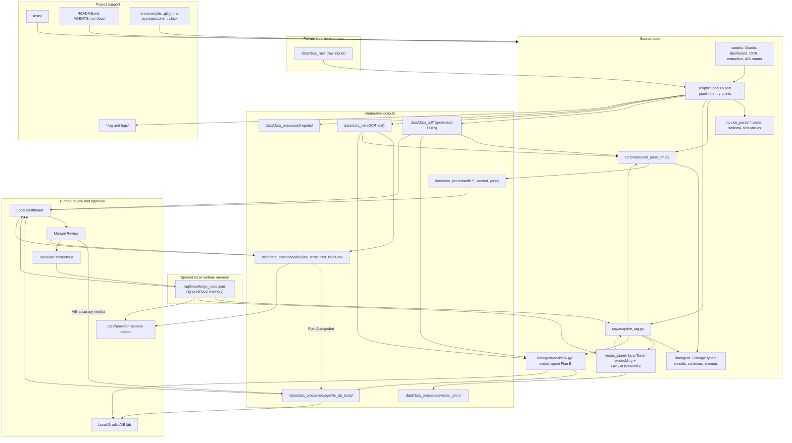

# Project Workflow Graph

This diagram shows the intended separation between source code, private local invoice data, runtime memory, generated outputs, review state, tests, logs, and documentation. It uses Mermaid syntax and does not require a graph dependency.

Safety boundaries:

- Treat `data/data_raw/` as immutable input. The ignored `data/` tree stays local because invoices and generated artifacts may contain private information.
- Write generated OCR, PDF, CSV, report, Gemini, A/B, and vector-index artifacts only under `data/`.
- Keep provider memory in `rag/knowledge_base.json`; it may contain reviewer feedback and should remain ignored unless sanitized.
- Provider-memory retrieval uses a deterministic local Torch embedding with FAISS/LlamaIndex; it does not download an embedding model.
- Keep secrets and unapproved private invoice data out of logs, docs, generated reports, and committed files.
